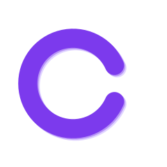

<div align="center">
  
  <h1>Chirp</h1>
  <p><strong>Free, cross-platform eye care for people who stare at screens all day.</strong></p>

  
  
  
  
</div>

---

Chirp reminds you to take breaks, blink, and fix your posture using the **20-20-20 rule**: every 20 minutes, look at something 20 feet away for 20 seconds. Unlike other break reminder apps, Chirp works across all your devices, pauses itself when you're in meetings, and never phones home with your data.

<div align="center">
  
  &nbsp;&nbsp;&nbsp;
  
</div>

## Install

```bash
# macOS
brew install --cask chirp

# Windows
winget install chirp

# Linux
snap install chirp
```

Or download the latest release from [GitHub Releases](https://github.com/anthropics/chirp/releases).

## Features

| | Feature | Description |
|---|---------|-------------|
| **Core** | |
| :alarm_clock: | **Smart Break Timer** | Customizable work/break intervals based on the 20-20-20 rule |
| :eye: | **Blink Reminders** | Gentle nudges to blink (we blink 66% less at screens) |
| :person_in_lotus_position: | **Posture Check** | Regular posture reminders with customizable intervals |
| :bell: | **Custom Reminders** | Create your own: drink water, stretch, take medicine |
| **Productivity** | |
| :tomato: | **Pomodoro Timer** | Built-in 25/5/15 Pomodoro cycles alongside break reminders |
| :calendar: | **Work Schedule** | Set active hours so reminders respect your time |
| :zzz: | **Idle Detection** | Auto-pauses when you step away from your computer |
| **Smart** | |
| :robot: | **Smart Pause** | Auto-pauses during meetings, video calls, and fullscreen apps |
| :chart_with_upwards_trend: | **Adaptive Reminders** | Adjusts reminder frequency based on your patterns |
| **Tracking** | |
| :dart: | **Health Score** | Daily 0-100 score tracking breaks, compliance, and session time |
| :bar_chart: | **Stats Dashboard** | Historical trends and break compliance analytics |
| **Connectivity** | |
| :iphone: | **Mobile Companion** | iOS and Android apps that sync with your desktop |
| :people_holding_hands: | **Team Dashboard** | Aggregate health scores and admin controls for teams |
| :globe_with_meridians: | **Browser Extension** | Chrome and Firefox extension for break reminders in your browser |

## Why Chirp?

| Feature | Chirp | LookAway | Stretchly | Time Out |
|---------|:-----:|:--------:|:---------:|:--------:|
| **Price** | **Free forever** | $19-29 | Free | Freemium |
| Mac + Windows + Linux | **Yes** | Mac only | Yes | Mac only |
| iOS & Android | **Yes** | iPhone only | No | No |
| Smart Pause (meetings, video) | **Yes** | Yes | Idle only | No |
| Pomodoro timer | **Yes** | No | No | No |
| Blink & posture reminders | **Yes** | Yes | No | No |
| Health score & stats | **Yes** | Yes | No | Limited |
| Custom reminders | **Yes** | No | No | No |
| Team dashboard | **Yes** | No | No | No |
| Browser extension | **Yes** | No | No | No |
| Zero tracking / telemetry | **Yes** | No | Yes | No |

## Privacy

Chirp collects **nothing**. Zero analytics, zero telemetry, zero crash reporters, zero user accounts. All data stays on your device. Device pairing and team sync are optional and can be self-hosted.

## Building from Source

Chirp is built with [Flutter](https://flutter.dev). You'll need the Flutter SDK installed.

```bash
git clone https://github.com/anthropics/chirp.git
cd chirp
flutter pub get
flutter run -d macos    # or: windows, linux, chrome
```

## Contributing

PRs are welcome. For larger changes, please open an issue first to discuss what you'd like to change.

## License

[MIT](LICENSE)
